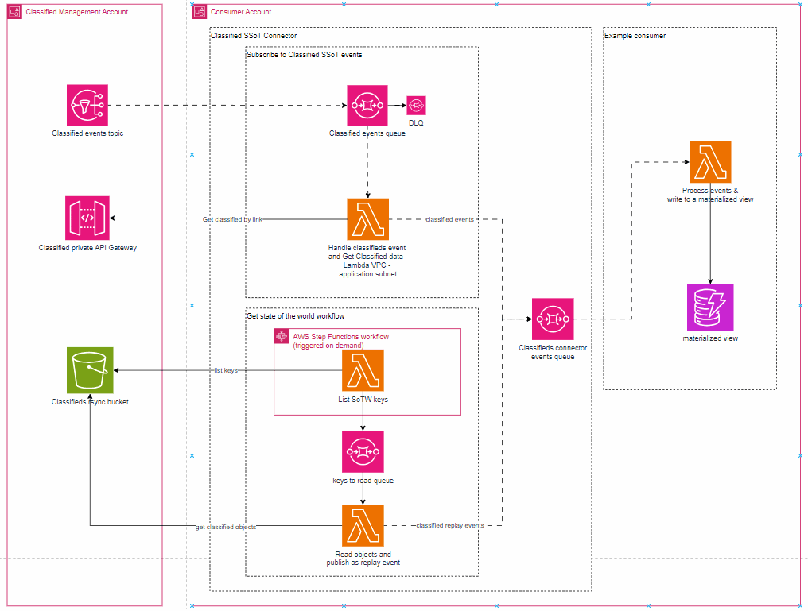
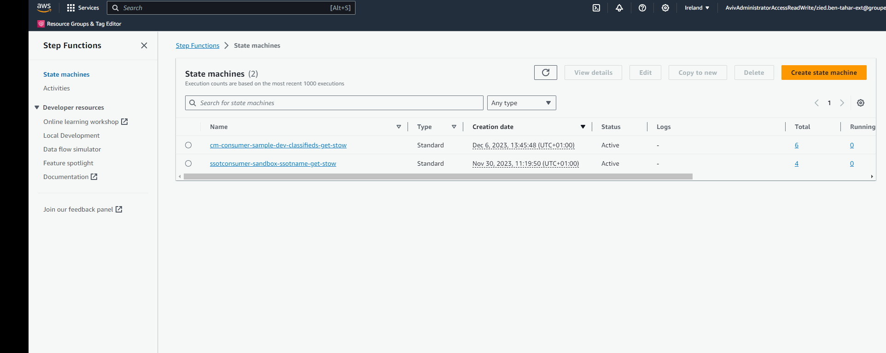
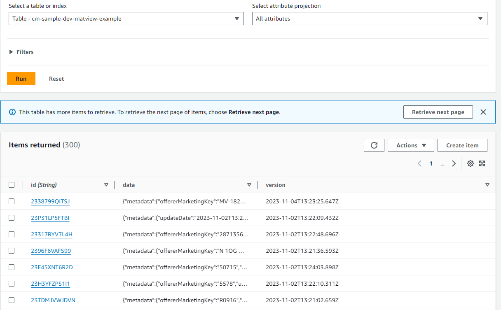

# Getting started

You will find here a concrete implemention of Classified Management consumer.

By deploying  this application into your account, you will be able:
*  to consume events from Classified Management 
* and  to request the current state of the world of classifieds. 

Along with classified management connector, you will find an example on how to create a materialized view where you can store your own adapted/enriched models of classifieds.

.


## code structure
* In the `src` dir you will find the code of the lambda functions
     *  [cm-connector](./src/cm-connector/) all lambda functions that implement classified management connector logic
     * [cm-consumer-example](./src/cm-consumer-example/) an example on how to consume events to build a materialized view
     * [shared/models](./src/shared/models) you will find the classified model your are consuming

* In the `infra` dir you will find the terraform code of this solution
     * [cm-connector](./infra/modules/cm-connector/) a generic ssot connector infra module
     * [cm-consumer-example](./infra/modules/cm-consumer-example/) terraform module containing a suppoting example on how to consume events to build a materialized view


### On using the classified management terraform connector module


Here is an example on how to use [this module](./infra/modules/cm-connector/) in order to consume classified management

```
module "cm_connector" {
  source = "./modules/cm-connector"
  
  bucket = {
    # bucket id of the rsync bucket
    id = "aviv-classdisp-dev-staging-resync-bucket"
  }
  
  events_topic = {
    # classified events event topic
    arn = "arn:aws:sns:eu-west-1:272575627684:classdisp-staging-dispatch-classified-event-topic"
  }

  api = {
    # classified api
    url = "https://classmgt-staging-api.kind-camel-dev.aws.aviv-internal.eu"
  }

  application = var.application
  environment = var.environment
  ssot_name =  "classifieds"
}


```
## FAQ
### Before deploying
First, you will need to get your AWS account(s) allowed to consume classified management. You will need to create a JIRA ticket as mentioned on this page: https://avivgroup.atlassian.net/wiki/spaces/APE/pages/375620475/Subscribe+to+SSOT+events

### Classified Management API secrets
[The connector creates a secret](./infra/modules/cm-connector/cm-events-handling/cm-api-secret.tf) that must contain the API ClientId & Authorization in order to be able to call Classified Management API.

> [!IMPORTANT]  
> **An important step**: Once your account is authorized > to consume classifieds, you will need to set these > values into the secret :
> ```
> {
>   "ClientId":"<Client Id provided by CM>",
>   "Authorization":"<Authorization provided by CM>"
> }
> 
> ```


### Running an initialization job
Once sucessfully deployed, you start getting events from classified management. If you want to run a "Get state of the world" operation in order to get the complete set of classifieds you will need to go to you aws console and execute the `get state of world` state machine (by default this state machine will have this name `cm-consumer-sample-dev-classifieds-get-stow`)
by specifying this input parameters to the state machine:
```
{
   "prefix": "The prefix of the classifieds on the classifieds ssot bucket"
}
```
more precisely, if you want to start reading all IWT active classified you will need to provide this input
```
{
   "prefix": "ACTIVE/0/IWT/"
}
```

.

Alternatively, you can trigger the initialization job with aws cli 

```
aws stepfunctions start-execution --state-machine-arn arn:aws:states:eu-west-1:ACCOUNT_ID:stateMachine:cm-sample-dev-classifieds-get-stow --name SOME_JOB_ID  --input '{ \"prefix\":\"ACTIVE/0/IWT/\" }'
```

Along with the connector, you will find [an example of a lambda function](./src/cm-consumer-example/) that consumes complete classifieds from the connector and save them on a [dynamodb table as a materialized view](./infra/modules/cm-consumer-example/consumer-materialized-view.tf)




if you want to start reading all IWT Deleted classified you will need to provide this input
`

{
  "prefix": "DELETE/0/IWT/",
  "operation": "delete"
}

### Wait ! Why are we using a step function to get the state of the world ?

Lambda functions have a maximum timeout of 15 minutes. Attempting to list and read the S3 state of the world bucket, which holds millions of classifieds, in a single lambda function execution would result in timeouts.

To address this issue, the following solution has been implemented:

1 - The solution leverages a step function that manages object listing by prefix from the bucket. The listing is accomplished within a state machine "loop". In each iteration, `List stow keys` is invoked. Each invocation has an input parameter relative to the bucket object listing pagination, that is a `NextContinuationToken` obtained from the last `ListObjectsV2Command` command invocation. The initial lambda invocation is executed with an empty `NextContinuationToken`.

2 - The "List sotw keys" lambda execution retrieves the keys listed from the bucket and emits them on a queue. So that they can be processed in parallel with `Read objects & publish as replay events`

3 - The `Read objects & publish as replay events` lambda processes the object keys in parallel to read their content and publish them as replay events.

The solution guarantees that classified sync operation is done as fast as possible given the amount of concurrency the `Read objects & publish as replay events` is assigned


### Getting access to Classified Management APIs
You will find more about classified management APIs here: 
* [REST API](https://classmgt.kind-camel-preview.aws.aviv-internal.eu/docs/stage/v0/index.html)
* [Classified events docs](https://classdisp.kind-camel-dev.aws.aviv-internal.eu/docs/staging/external/0.1/streams.html)
* [S3 Bucket objects layout](https://classdisp.kind-camel-dev.aws.aviv-internal.eu/docs/staging/external/0.1/streams.html#:~:text=The%20files%20in%20the%20s3%20are%20created%20in%20real%20time%20during%20the%20creation%20in%20the%20SSOT%20database%2C%20so%20to%20avoid%20the%20double%20consumption%20of%20the%20events%20(s3%20and%20SNS)%2C%20we%20advise%20you%20to%20stop%20the%20consumption%20of%20our%20SNS%20during%20the%20initialization%20phase.)


### Update SQL Part
execute sqs event :
{
    "type": "classified.init.v1"
}