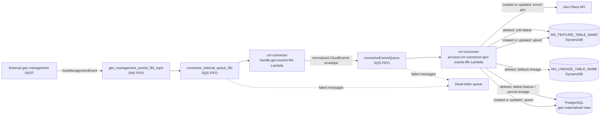

# Getting started

You will find here a concrete implementation of the Geo Management consumer.

By deploying this application into your account, you will be able to:
* consume events from Geo Management

Along with the Geo Management connector, this repository includes a materialized-view consumer that stores adapted and enriched Geo models.

.

## Architecture



> See the [cm-connector-consumer-architecture skill](./.github/skills/cm-connector-consumer-architecture/SKILL.md) for the full breakdown of each step.

> Latest release: [GDA-217](./docs/releases/GDA-217.md) — Geo stale-write protection and consumer reliability.

## code structure
* In the `src` dir you will find the code of the lambda functions
    * [cm-connector](./src/cm-connector/) contains the Lambda functions that implement the Geo Management connector logic
    * [cm-consumer](./src/cm-consumer/) contains the consumer logic that builds the materialized view
    * [shared/models](./src/shared/models) contains the Geo models being consumed

* In the `infra` dir you will find the Terraform code for this solution
    * [cm-connector](./infra/modules/cm-connector/) is the generic SSOT connector infra module
    * [cm-consumer](./infra/modules/cm-consumer/) contains the Terraform for the materialized-view consumer pipeline


### Using the Geo Management Terraform connector module

Here is an example of how to use [this module](./infra/modules/cm-connector/) to consume Geo Management data.

```
module "cm_connector" {
  source = "./modules/cm-connector"
  
  bucket = {
    # bucket id of the rsync bucket
    id = "geo-export-delivery-backbone-witty-puma"
  }
  
  events_topic = {
    # geo events event topic
    arn = "arn:aws:sns:eu-west-1:090290096726:geodata_updates.fifo
  }

  api = {
    # geo api
    url = "https://place-api.cosmic-bullfrog-dev.aws.aviv.eu"
  }

  application = var.application
  environment = var.environment
  ssot_name =  "geos"
}


```
### Running an initialization job

Along with the event driven connector, the solution ships a container task that
loads the geo parquet export into the aurora postgres cluster of the account.
It is a Fargate task rather than a lambda function because a full snapshot does
not fit in the 15 minutes lambda budget.

* [src/geo-bulk-load](./src/geo-bulk-load/) contains the task and the PostgreSQL load logic; its image is built from [DockerfileBatchCopyDatalake](./DockerfileBatchCopyDatalake) at the repository root.
* [infra/modules/geo-bulk-load](./infra/modules/geo-bulk-load/) contains the ECR repository, ECS cluster, task definition and dedicated database secret.

> For a detailed walkthrough of the full Parquet -> DuckDB -> PostgreSQL -> DynamoDB pipeline, see the [geo-bulk-load-architecture skill](./.github/skills/geo-bulk-load-architecture/SKILL.md).

### How it works

DuckDB reads the configured Parquet snapshot directly from S3 and writes the
mapped columns to PostgreSQL through the `postgres` extension. The task first
loads a staging table, updates existing `geoName` rows, inserts new rows, and
then drops the staging table.

```
s3 parquet snapshot ──duckdb──> PostgreSQL staging table ──> geoName table
```

### Configuring the snapshot

Set these Terraform variables in the environment tfvars file:

```hcl
geo_management_sync_bucket = "geo-export-delivery-backbone-witty-puma"
geo_management_bucket_key = "miracle/snowflake/20260731205419-live"
```

The task reads the Parquet files below the `name` directory using the
`/**/*.parquet` glob. `geo_management_bucket_key` should therefore identify
the snapshot root, not the `name` directory itself.

The task reads database credentials from the dedicated Secrets Manager secret
created by the `geo-bulk-load` Terraform module. After the first `terraform
apply`, populate that secret with at least:

```json
{
  "DbUsername": "...",
  "DbPassword": "..."
}
```

The database host, port, name and schema are supplied separately as ECS
environment variables.

### Running a load

The image is built and pushed by the `push-geo-bulk-load-image` ci job, right
after the terraform apply that creates the ecr repository. Then:

```
aws ecs run-task \
  --cluster gm-consumer-dev-geo-bulk-load \
  --task-definition gm-consumer-dev-geo-bulk-load \
  --launch-type FARGATE \
  --network-configuration 'awsvpcConfiguration={subnets=[SUBNET_IDS],securityGroups=[SG_ID],assignPublicIp=DISABLED}'
```

`terraform output` prints the command with the subnets and the security group
already filled in. Set `geo_bulk_load_schedule_expression` in the tfvars to run
it on a schedule instead.

Useful overrides, as container environment variables:

| variable | default | effect |
| --- | --- | --- |
| `GEO_MANAGEMENT_SYNC_BUCKET` | Terraform value | S3 bucket containing the export |
| `GEO_MANAGEMENT_BUCKET_KEY` | Terraform value | Snapshot root containing the `name` directory |

### Local Docker run (quick test)

If the image builds but exits immediately, it is usually missing runtime
environment variables. At minimum, this task requires:

* `GEO_DB_SECRET_ID`
* `GEO_MANAGEMENT_SYNC_BUCKET`
* `GEO_MANAGEMENT_BUCKET_KEY`

Optional overrides:

* `AWS_REGION` (default: `eu-west-1`)

Example local run:

```bash
docker run --rm \
  -e AWS_REGION=eu-west-1 \
  -e GEO_DB_SECRET_ID=<your-secret-id> \
  -e GEO_MANAGEMENT_SYNC_BUCKET=<your-bucket> \
  -e GEO_MANAGEMENT_BUCKET_KEY=<snapshot-root> \
  geo-bulk-load:test
```

If the command fails with `GEO_DB_SECRET_ID is required`, add the missing
`-e GEO_DB_SECRET_ID=...` variable. If it fails with AWS auth errors, ensure
your container has credentials (for example through task role in ECS, or local
AWS credentials when testing outside ECS).

### On upserts

The load upserts on the primary key, so a row that disappeared from the export
survives in the table: nothing is deleted.

## Deploying

Each environment runs the same CircleCI workflow in `.circleci/job-configs.yml`:

```
build-geo-management-connector -> Docker build and push -> deploy-geo-management-connector
                                  (DockerfileBatchCopyDatalake -> ECR)   (terraform apply)
```

`live` adds a manual `Approve deploy to prod` approval before the image is built.

### Changing dependencies

The `Docker build and push` job runs `npm ci` from [DockerfileBatchCopyDatalake](./DockerfileBatchCopyDatalake)
against `src/package.json` and `src/package-lock.json`. `npm ci` refuses to
install unless the lock file matches `package.json` exactly, so **every change
to `src/package.json` must be followed by a regenerated lock file, in the same
commit**:

```bash
cd src
npm install --package-lock-only
```

> [!IMPORTANT]
> Never hand-edit `src/package-lock.json`. Adding or deleting entries by hand
> produces a tree npm did not compute, and the build fails with
> `npm error Missing: <package>@<version> from lock file` — pointing at a
> package you never touched.

The builder stage is `node:22-bookworm-slim`, which ships **npm 10**. If your
local npm is newer, the two can resolve *optional peer dependencies*
differently: npm 11 skips them, npm 10 installs them as a nested copy. A lock
file generated by npm 11 can therefore be accepted locally and rejected in the
image. When the error mentions a package that is not in `package.json` at all,
that is the cause.

Regenerate the lock with the same npm major as the image to be safe:

```bash
cd src
npx npm@10 install --package-lock-only
```

A lock file produced by npm 10 is accepted by both, so it is the safer default
for anything that lands on `main`. The two versions otherwise differ only in
`libc` metadata keys that npm 11 adds and npm 10 drops — noisy in a diff, but
it resolves the same packages, so there is no need to regenerate a working lock
file just to change npm version.

### Verifying before you push

Reproduce the CI install exactly, without a full image build:

```bash
docker run --rm -v "$PWD/src":/app -w /app node:22-bookworm-slim \
  npm ci --dry-run
```

`added N packages` means CI will install cleanly. Any `npm error code EUSAGE`
means the lock file is out of sync and the `Docker build and push` job will
fail. To check the build itself as well:

```bash
docker build -f DockerfileBatchCopyDatalake --target builder -t geo-bulk-load-check .
```

## FAQ
### Before deploying
First, you will need to get your AWS account(s) authorized to consume Geo Management data. You will need to create a JIRA ticket as mentioned on this page: https://avivgroup.atlassian.net/wiki/spaces/DATA/pages/2152267777/Consuming+geo+referential+data+updates


> [!IMPORTANT]  
> **An important step**: Once your account is authorized > to consume geo, you will need to set these > values into the secret :
> ```
> {
>   "ClientId":"<Client Id provided by CM>",
>   "Authorization":"<Authorization provided by CM>"
> }
> 
> ```

 


### Getting access to Geo Management APIs
You will find more about geo management APIs here: https://avivgroup.atlassian.net/wiki/spaces/DATA/pages/2152267777/Consuming+geo+referential+data+updates?xpis=eyJicmlkZ2UiOiJxdWlja0ZpbmQiLCJpZCI6IjE3ODg3NzQ3OTc4NDUiLCJzb3VyY2UiOiJjb25mbHVlbmNlIn0%3D