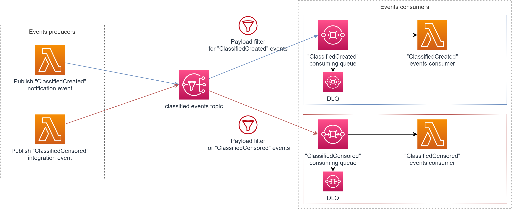

# Intro

This folder holds all the code samples supporting the "event model guidelines & convention" guild study

## Why defining standards on our event models ?

The goal of this topic is to work on defining Event Driven APIs standards, convention & guidelines. 
Implementing these standards in our events can provide us with many benefits:

- Standard way of processing events for event consumers (e.g. Event Filtering)
- Discovrability and documentation
- Standardized observability patterns and debugging options

## Study contents

- Confluence page related to this study: https://avivgroup.atlassian.net/wiki/spaces/AARCH/pages/306220332/DSDG+Event+models+standards

## Samples

### Cloudevent, AsyncAPI sample

You will find [here](./cloudevent-asyncapi-sample/) a sample application that leverage the use of cloudevent and asyncapi standards.

#### Sample content

- Producer/Consumer sample using CloudEvent spec  
- Contrat first approach
    - AsyncAPI [model generation](./cloudevent-asyncapi-sample/api-docs-tools/) - (Contract first approach)
    - [Event model validation](./cloudevent-asyncapi-sample/src/shared/validators/) with [AJV](https://ajv.js.org/)
- [IaC with terraform](./cloudevent-asyncapi-sample/infra/), 
- SNS/SQS subscription [payload filtering](./cloudevent-asyncapi-sample/infra/modules/classified-events-consumers/classified-censored-events-consumer.tf#L13)
- SQS partial [batch responses handling](https://docs.aws.amazon.com/prescriptive-guidance/latest/lambda-event-filtering-partial-batch-responses-for-sqs/best-practices-partial-batch-responses.html)
