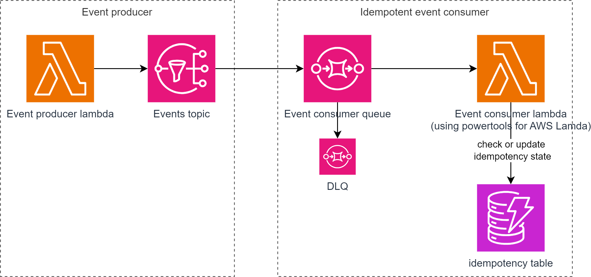

# Intro

This folder holds all the code samples that helps building idempotent event consumers.
These samples showcase how to handle idempotency on lambda based serverless workloads using [Lambda power tools](https://docs.powertools.aws.dev/lambda/typescript/latest/utilities/idempotency/).

[Lambda powertools](https://docs.powertools.aws.dev/lambda/typescript/latest/) is a suite of utilities that helps adopting best practices when writing Lambda functions.

## What is idempotency and what are idempotent event consumers ?

An idempotent event consumer processes events in a way that ensures that processing the same event multiple times has the same effect as processing it once. 

This concept is particularly important for operations that can have side effect or modify data. Idempotency ensures that even if an event is consumed multiple times due the delivery sementics (i.e. at-least-once) or network issues or retries, it doesn't produce unexpected effects.

Key design conciderations :
- Unique event idempotency key: We can leverage the unique event identifiers or a dedicated idempotency key generated based on payload of the event. Event consumers use idempotency keys to track which events have already been processed. When a consumer receives a duplicate event, it can check if it has processed that idempotency key before and, if so, skip processing.
- Idempotency state management: Consumers may need to maintain some state to keep track of processed events. This state includes the event idempotency key and the event consumption occurence timestamps that helps identify and handle duplicate events.
- Idempotency Window: There may be a time window during which an event is considered idempotent. Events received after this window may be treated as new events and processed.
- Atomicity: Idempotent processing should be atomic: The entire operation either succeeds or fails as a whole. This ensures that even if an event is processed more than once, the system remains in a consistent state.
- Error management: Event consumers should implement error-handling mechanisms to gracefully handle failures during event processing. For example, if processing an event fails, the consumer should be able to safely retry the processing without causing side effects.

Given all of these key conciderations, implementing custom idempotency logic can be error prone and it is recommended to use supported and tested libraries and tested. hence the use of Lambda power tools when building serverless workloads. 

## Samples

You will find [here](./src/) a sample serverless application that leverages the use of lambda power tools in order to be idempotent. 

#### idempotent sqs consumer with lambda powertools and cloudevents

##### Sample content

- Making [function call idempotent](./events-consumers/lambda-handlers/classified-censored-events-consumer.ts#L13) based on the `idempotencykey` property of the CloudEvent envelope
- SQS partial [batch responses handling](https://docs.aws.amazon.com/prescriptive-guidance/latest/lambda-event-filtering-partial-batch-responses-for-sqs/best-practices-partial-batch-responses.html) with [lambda powertools](./events-consumers/lambda-handlers/classified-censored-events-consumer.ts#L48)
- Producer/Consumer sample using CloudEvent spec  
- [Event model validation](./shared/validators/classifieds-events-validators.ts) with [AJV](https://ajv.js.org/)
- [IaC with terraform](./infra/), 

