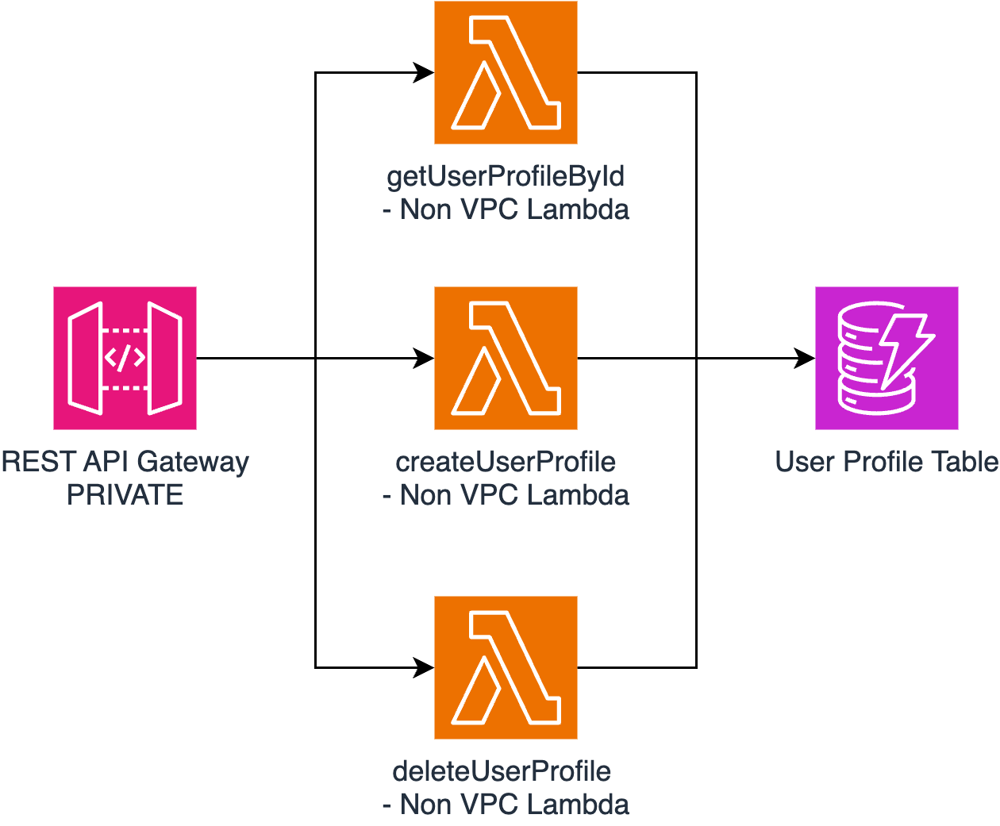

## Lambda-based API template
You will find here a blueprint of an API based on lambda functions & API Gateway. This blueprint can help you kick start you project with a complete code example and intrastructure as code

## Overview

This application exposes a private API to manage 'User Profiles', it provides `GET`, `POST` and `DELETE` endpoints. User profile data is stored in a DynamoDb table.

   

## Project Structure

This project is organized as follows:

- The `infra` directory for Terraform Infrastructure as Code (IaC). It contains:

    - `main.tf`: This is entrypoint.

    - `variables.tf`: This file defines the variables that are used in the Terraform configuration.

    - `outputs.tf`: This file defines the outputs from the Terraform configuration. These outputs can be used by other Terraform configurations or for debugging purposes.

    - `modules/user-profile-management`: This module contains all the components relative to the API : API Gateway, DynamoDb Table and Lambda functions definitions

    
- The `src` directory where the source code  are located. This code follows an opiniated & simplified hexanogal architecture structure:
    - `adapters` holds all the secondary adapters (e.g. User Profile repository, logging, Secrets repository)
    
    - `lambda-handlers` is where the primary adapters are located which are primaraly the lambda handlers
    
    - `use-cases`is where use case implementation is happening, in this folder you will find genrally the business logic related to the application

    - `models` is where schemas & model definitions happening
        
         
