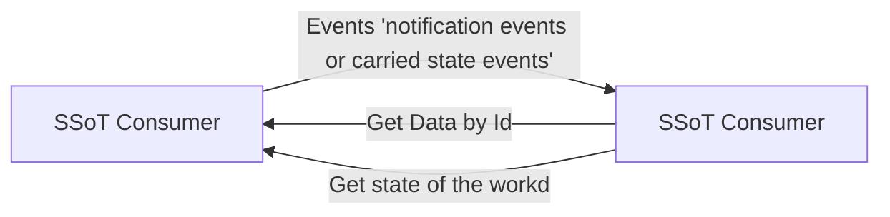
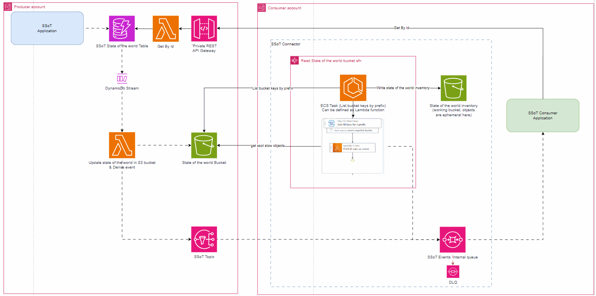

# SSOT Pattern

## Motivation

In an event-driven architecture, Single Source of Truth (SSoT) consumers may want to request a “state of the world” from SSoT producers (e.g. Classified Management). This enable SSOT consumers:
* to keep their application consistent
* to recover from errors
* to validate new feature in their application.
* or to rebuild reference data into your own application context to be resilient 

[Several stragies](https://avivgroup.atlassian.net/wiki/spaces/AARCH/pages/321302652/DSDG+SSOT+pattern+and+Event+Replay) are possible when building this pattern. 
In this sample we will focus on [this strategy](https://avivgroup.atlassian.net/wiki/spaces/AARCH/pages/321302652/DSDG+SSOT+pattern+and+Event+Replay#Strategy-1%3A-SSOT-producers-publish-events-and-store-the-state-of-the-world-on-an-S3-bucket.-For-initialization-purpose%2C-each-event-consumer-read-and-feed-this-data-into-its-own-context-by-feeding-the-data-from-the-state-of-the-world-bucket.) as it provides fullfill our current needs while being cost effective end with less maintainance on both producer & consumer side.

## Solution overview

.

### Producer: 
On this solution a producer saves its state of the world (e.g. Classifieds, Agency Data, etc.) in two stores: 
* A DynamoDb: That will serve the need to "Get an Item By Its Id" exposed as an operation of a REST API
* An S3 bucket: That Serves the needs to "re-init" consumers when required (feeding a new system, recover from errors that are not possible to manage by classic SQS/DLQ on consuption side). 

Both of these two stores are kept in sync.

### Consumer:
The consumer subscribes to events from the consumer and handle them according to their own business requirements.

In the case when a full re-init is required, Consumers can query the state for the world from the S3 instead of querying directly the API. We put forward this solution  for several reasons:

* A Producer can have millions of items (e.g. Classifieds), Querying the API can incur cost and is generally equivalent to a scan operation on the DynamoDb table which is not recommended practice with regards to the table capacity & cost.

* Self service aspect of it: Consumers can decide to get the state of the world without requiring the producer team to scale accordingly. Here we are offloading some aspects related to the capacity planning and scaling to S3. 

In this Consumers leverage "step functions distributed map" feature that allows to process the S3 bucket items in parallel. Making the re-init part a fast operation with a very low cost (At the time of writing, reading 1.377.000 classifieds takes an average of 10 minutes)
