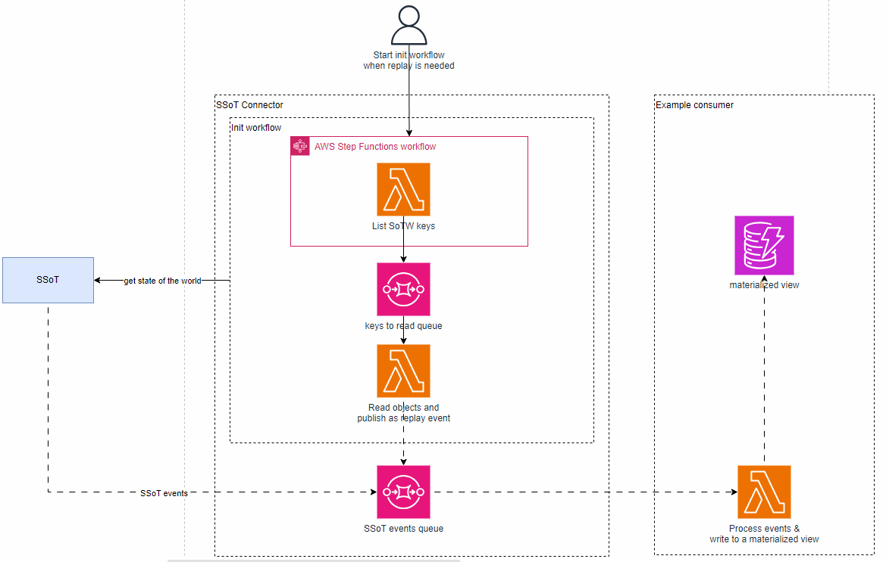

# Getting started

You will find here a generic example on how to build an SSoT consumer.

This sample provides the interface that an SSoT consumer should build:

* A queue for SSoT events that is subscribed to the SSoT topic. This queue provides you with all events published from the SSOT as well as "replay" events when you ask from *Get state of the world*.

* A 'Get State of the World' step function enables you to initialize your consumer by retrieving the current state of an SSoT from its designated bucket. This workflow dispatches SSOT State of the World entities as replay events on the SSOT events queue."


Additionally, this sample demonstrates the creation of a materialized view, specifically using DynamoDB, where SSoT entities will be stored.

.

## Init & using your own models and namings

This example is designed with a generic model and naming convention. You can utilize [this tool to customize](./tools/gen/) it according to your SSoT you are consuming. This setup is a one-time operation. Subsequently, you have the flexibility to modify the code to seamlessly integrate it into your existing ecosystem.

## code structure
* In the `src` dir you will find the code of the lambda functions
     *  [ssot-connector](./src/ssot-connector) all lambda functions that implement ssot connector logic
     * [ssot-consumer-example](./src/ssot-consumer-example/) an example on how to consume events to build a materialized view
     * [shared/models](./src/shared/models) you will find the SSoT entities models your are consuming

* In the `infra` dir you will find the terraform code of this solution
     * [ssot-connector](./infra/modules/ssot-connector/) a generic ssot connector infra module
     * [ssot-consumer-example](./infra/modules/ssot-consumer-example/) terraform module containing a suppoting example on how to consume events to build a materialized view


### On using the SSoT connector module


Here is an example on how to use [this module](./infra/modules/ssot-connector/) in order to consume more that one SSoT

```
#Connecting to SSoT 1
module "ssot_connector_<<ssot_name_1>>" {
  source = "./modules/ssot-connector"
  bucket = {
    id = <<The id of the SSoT 1 SoTW bucket>>
  }
  ssot_events_topic = {
    arn = <<The arn of the SSoT 1 events topic>>
  }
  application = var.application
  environment = var.environment
  ssot_name =  "${var.ssot_name}"
}

#Connecting to SSoT 2
module "ssot_connector_<<ssot_name_2>>" {
  source = "./modules/ssot-connector"
  bucket = {
    id = <<The id of the SSoT 2 SoTW bucket>>
  }
  ssot_events_topic = {
    arn = <<The arn of the SSoT 2 events topic>>
  }
  application = var.application
  environment = var.environment
  ssot_name =  "${var.ssot_name}"
}

```


