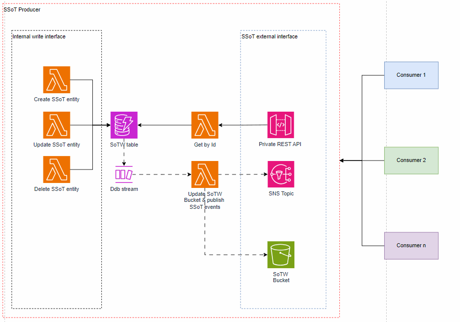

# Getting started

You will find here a generic example on how to build an SSoT producer.
This sample provides the interface that an SSoT producer should provide to it's consumers:

* A *get By Id*  endpoint exposed via a private api gateway to let consumers get entity data by Id
* A *state of the world* bucket to let consumers retrieve the current state of ssot for init purposes and all the
* And an *ssot event topic*. Consumers subscribe to this topic to get updates from an ssot. In this example the full ssot entity state is published into the topic on (Create, Update or Delete). [You can find here](./api-docs/asyncapi.yaml) the AsyncAPI documentation of the events.   

Additionaly, this sample provides you with an internal SSoT write interface, with wich you can Create, Update or Delete SSoT entities on the state of world DynamoDb store.

.

## Init & using your own models and namings

This example is designed with a generic model and naming convention. You can utilize [this tool to customize](./tools/gen/) it according to your own SSoT entity model. This setup is a one-time operation. Subsequently, you have the flexibility to modify the code to seamlessly integrate it into your existing ecosystem.

## code structure
* In the `src` dir you will find the code of the lambda functions
     *  [ssot-api](./src/ssot-api) you will find the lambda function handlers responsible of the producer interface (expose get by Id, event publishing & sotw bucket snapshot building)
     * [ssot-store](./src/ssot-store) you will find the lamba function handlers responsible of the internal write interface
     * [shared/models](./src/shared/models) you will find the SSoT entities models & internal write interface commands. 

* In the `infra` dir you will find the terraform code of this solution
     * [ssot-store](./infra/modules/ssot-store/) terraform module defining the internal write interface
     * [api](./infra/modules/api) terraform module defining the SSoT interface exposed to its consumers

